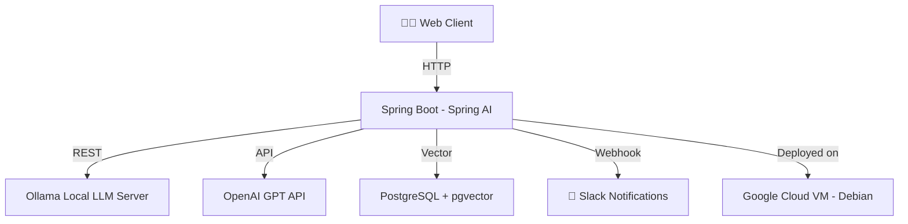

# 🌿 NRF Spring AI Chat

> **Spring AI 기반 멀티 모델 챗봇 애플리케이션**  
> OpenAI · llama3 등 다양한 AI 모델을 통합하여 대화 기반 서비스를 제공합니다.

---

## 📘 프로젝트 개요

**NRF Spring AI Chat**은  
Spring AI의 추상화된 모델 아키텍처를 기반으로 **여러 AI 모델(OpenAI, llama3 등)** 을 단일 애플리케이션에서 손쉽게 전환하며 사용할 수 있도록 설계된 **통합형 AI 채팅 플랫폼**입니다.

> 본 서비스는 **Google Cloud VM (Debian 기반)** 환경에서 운영되며,  
> Spring Boot 백엔드 + llama3 로컬 LLM 서버가 함께 구동됩니다.  
> 운영 환경(`prod`)에서는 **Slack Webhook**을 통해 AI 응답 로그 및 시스템 이벤트가 자동 알림됩니다.

---

## 🧩 Spring AI 주요 개념 반영

Spring AI는 “AI 애플리케이션을 Spring스럽게” 만들기 위한 프레임워크입니다.  
본 프로젝트는 Spring AI의 주요 개념을 아래와 같이 반영합니다.

| 구성요소 | 설명 | 프로젝트 내 구현 |
|-----------|------|----------------|
| **Model Abstraction** | OpenAI, llama3 등 다양한 모델을 `ChatModel`, `EmbeddingModel` 인터페이스로 통합 관리 | `ChatModel` / `EmbeddingModel` Bean 설정 |
| **AI Client** | AI 모델과 상호작용하는 고수준 API (ChatClient, EmbeddingClient 등) | `spring-ai` 자동 구성 기반 |
| **Vector Store** | 텍스트 임베딩을 저장/검색하기 위한 데이터베이스 (예: PgVector) | `PgVectorStoreConfig` 설정 |
| **Retriever** | 문서에서 관련 정보를 검색해 모델 입력으로 제공 | 향후 RAG 확장 시 사용 예정 |
| **RAG Pipeline** | Retrieval-Augmented Generation 구조로 문서 기반 질의응답 | 향후 문서 Q&A 기능으로 확장 계획 |

---

## ⚙️ 기술 스택

| 구분 | 기술                                         |
|------|--------------------------------------------|
| **Backend** | Spring Boot 3.x, Spring AI                 |
| **Frontend** | HTML, CSS, Vanilla JavaScript              |
| **AI Models** | OpenAI GPT-4o Mini, kanana-nano-2.1b, Llama3    |
| **Vector DB** | PostgreSQL + PgVector                      |
| **Build Tool** | Maven                                      |
| **Infra** | Google Cloud VM (Debian 기반, n1-standard-1) |
| **Notification** | Slack Webhook (운영환경 로그/이벤트 전송)             |

---

## ✨ 주요 기능

- 🔁 **AI 모델 전환 기능** — OpenAI ↔ llama3 간 실시간 전환
- 💬 **실시간 채팅 인터페이스** — 모델 응답 스트리밍 지원
- 🧠 **임베딩 및 벡터 검색 구조** — 문서 기반 질의응답 확장 대비
- 📝 **대화 로그 관리** — Logback 기반 로깅 및 운영 모니터링
- 📢 **Slack 연동** — 운영환경 이벤트/오류 실시간 알림
- 🌐 **Google Cloud VM 운영환경** — 경량 CPU 기반 LLM 구동(kanana-nano-2.1b 등)

---

## ☁️ 서비스 구성도

---
🔮 향후 확장 계획

📚 RAG (Retrieval-Augmented Generation) 기반 문서 Q&A 챗봇 구현

🧾 PDF / 문서 벡터화 파이프라인 추가

🗂️ VectorStore 관리 도구 (조회, 삭제, 유사도 분석)

🧑‍💼 조직별 AI 모델 설정 프로필화 (기관별 모델 커스터마이징)